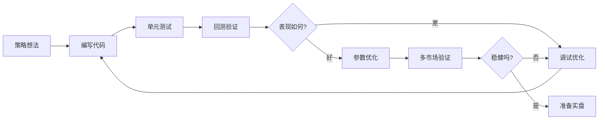

# 策略开发指南

**版本**: v0.4.0
**目标**: 帮助开发者快速掌握 zigQuant 策略开发
**级别**: 从入门到高级

---

## 📚 文档导航

### 🚀 入门教程

1. **[快速开始](./quickstart.md)** ⭐
   - 15 分钟创建第一个策略
   - 完整的示例代码
   - 回测和优化流程

2. **[IStrategy 接口](./interface.md)**
   - 策略接口详解
   - 生命周期管理
   - 最佳实践

3. **[StrategyContext](./context.md)**
   - 上下文 API 参考
   - 数据访问方法
   - 性能优化技巧

### 📊 进阶指南

4. **[技术指标使用](./indicators.md)**
   - 所有 15+ 指标的使用方法
   - 多指标组合技巧
   - 性能优化建议

5. **[调试和测试](./debugging.md)**
   - 单元测试编写
   - 日志和调试技巧
   - 常见错误排查

6. **[最佳实践](./best-practices.md)**
   - 代码组织
   - 性能优化
   - 安全注意事项
   - 常见陷阱避免

### 📖 示例策略

7. **[示例 1: 简单趋势跟随](./examples/01_simple_trend.md)**
   - 入门级策略
   - 单指标使用
   - 基本信号生成

8. **[示例 2: 多指标组合](./examples/02_multi_indicator.md)**
   - 中级策略
   - 多重确认机制
   - 状态管理

9. **[示例 3: 状态机策略](./examples/03_state_machine.md)**
   - 中级策略
   - 复杂状态转换
   - 条件逻辑

10. **[示例 4: 动态参数](./examples/04_dynamic_params.md)**
    - 高级策略
    - 自适应参数调整
    - 市场环境检测

11. **[示例 5: 复杂入场确认](./examples/05_complex_entry.md)**
    - 高级策略
    - 多层过滤器
    - 风险管理

### ❓ 参考资料

12. **[FAQ - 常见问题](./faq.md)**
    - 20+ 常见问题解答
    - 分类检索
    - 快速解决方案

---

## 🎯 学习路径

### 路径 1: 快速上手（1-2 小时）

```
quickstart.md → 运行示例 → 第一个策略回测
```

**适合**: 希望快速体验的用户

### 路径 2: 系统学习（1-2 天）

```
quickstart.md → interface.md → context.md → indicators.md →
examples/01-03 → debugging.md → best-practices.md
```

**适合**: 认真学习策略开发的用户

### 路径 3: 深入掌握（3-5 天）

```
完整阅读所有文档 → 实现 5 个示例策略 → 自定义策略开发 →
参数优化 → 多策略组合
```

**适合**: 专业量化交易者

---

## 📦 配套资源

### 示例代码

```
examples/strategies/
    ├── tutorial/                    # 教程示例
    │   ├── 01_hello_strategy.zig
    │   ├── 02_using_indicators.zig
    │   ├── 03_risk_management.zig
    │   ├── 04_state_tracking.zig
    │   └── 05_advanced_signals.zig
    ├── tutorial_configs/            # 配置文件
    │   ├── 01_hello_strategy.json
    │   └── ...
    └── builtin/                     # 内置策略参考
        ├── dual_ma.zig
        ├── rsi_mean_reversion.zig
        ├── bollinger_breakout.zig
        ├── triple_ma.zig            # v0.4.0
        └── macd_divergence.zig      # v0.4.0
```

### 测试数据

```
data/
    ├── BTCUSDT_1h_2024.csv         # Bitcoin 1小时数据
    ├── ETHUSDT_1h_2024.csv         # Ethereum 1小时数据
    └── sample_100.csv              # 测试用小数据集
```

---

## 🔧 开发环境设置

### 1. 安装 zigQuant

```bash
git clone https://github.com/your-repo/zigQuant
cd zigQuant
zig build
```

### 2. 验证安装

```bash
zig build test
zig build run -- --help
```

### 3. 运行示例

```bash
# 回测内置策略
zig build run -- backtest \
  --strategy dual_ma \
  --config examples/strategies/dual_ma.json

# 运行教程示例
zig build run-example-strategy-tutorial
```

---

## 📝 策略开发工作流

### 标准流程



### 步骤详解

1. **策略想法**
   - 基于技术分析或量化理论
   - 明确入场和出场规则
   - 定义风险管理方案

2. **编写代码**
   - 实现 IStrategy 接口
   - 使用 StrategyContext 访问数据
   - 调用技术指标

3. **单元测试**
   - 测试策略逻辑
   - 验证边界条件
   - 检查内存泄漏

4. **回测验证**
   - 使用历史数据回测
   - 分析性能指标
   - 检查交易合理性

5. **调试优化**
   - 修复逻辑错误
   - 优化性能
   - 改进信号质量

6. **参数优化**
   - 使用 `optimize` 命令
   - 网格搜索最优参数
   - Walk-Forward 验证

7. **多市场验证**
   - 测试不同币种
   - 测试不同时间周期
   - 测试不同市场环境（牛市/熊市/震荡）

8. **准备实盘**
   - 最终审查代码
   - 设置风险参数
   - 小资金测试

---

## 💡 重要提示

### ⚠️ 风险警告

1. **回测不等于实盘**
   - 历史表现不代表未来收益
   - 实盘有延迟、滑点等因素
   - 心理因素影响执行

2. **参数过拟合**
   - 避免过度优化
   - 使用 Walk-Forward 验证
   - 在多个市场测试

3. **资金管理**
   - 从小资金开始
   - 严格执行止损
   - 分散投资

### ✅ 最佳实践

1. **代码质量**
   - 编写单元测试
   - 使用 GPA 检测内存泄漏
   - 添加清晰的注释

2. **策略设计**
   - 保持简单（KISS 原则）
   - 避免前瞻偏差
   - 使用多重确认

3. **回测验证**
   - 至少 30 笔交易
   - 测试多个时间段
   - 考虑手续费和滑点

---

## 🔗 相关资源

### 内部文档

- [Backtest Engine 文档](../../features/backtest/README.md)
- [Indicators 文档](../../features/indicators/README.md)
- [CLI 使用指南](../../features/cli/usage-guide.md)
- [Optimizer 文档](../../features/optimizer/README.md)

### 外部资源

- [TA-Lib 文档](https://ta-lib.org/function.html) - 技术指标参考
- [Investopedia](https://www.investopedia.com/) - 交易知识百科
- [QuantStart](https://www.quantstart.com/) - 量化交易教程

### 社区

- GitHub Issues: [提问和讨论](https://github.com/your-repo/zigQuant/issues)
- 示例库: [社区策略分享](https://github.com/your-repo/zigQuant-strategies)

---

## 📈 学习建议

### 新手建议

1. 从简单策略开始（如双均线）
2. 理解每个指标的含义
3. 多尝试，多回测
4. 不要急于实盘

### 进阶建议

1. 学习多指标组合
2. 实现复杂的入场逻辑
3. 研究风险管理
4. 参数优化和验证

### 高级建议

1. 自适应策略开发
2. 机器学习集成（v1.0+）
3. 组合策略管理
4. 高频策略优化

---

## 🎓 下一步

选择您的学习路径：

1. **完全新手？** → 从 [快速开始](./quickstart.md) 开始
2. **有编程经验？** → 直接看 [IStrategy 接口](./interface.md)
3. **想看示例？** → 浏览 [示例策略](./examples/)
4. **遇到问题？** → 查看 [FAQ](./faq.md)

---

**祝您交易顺利！Happy Trading! 🚀**

---

**创建时间**: 2024-12-26
**最后更新**: 2024-12-26
**维护者**: zigQuant Team
