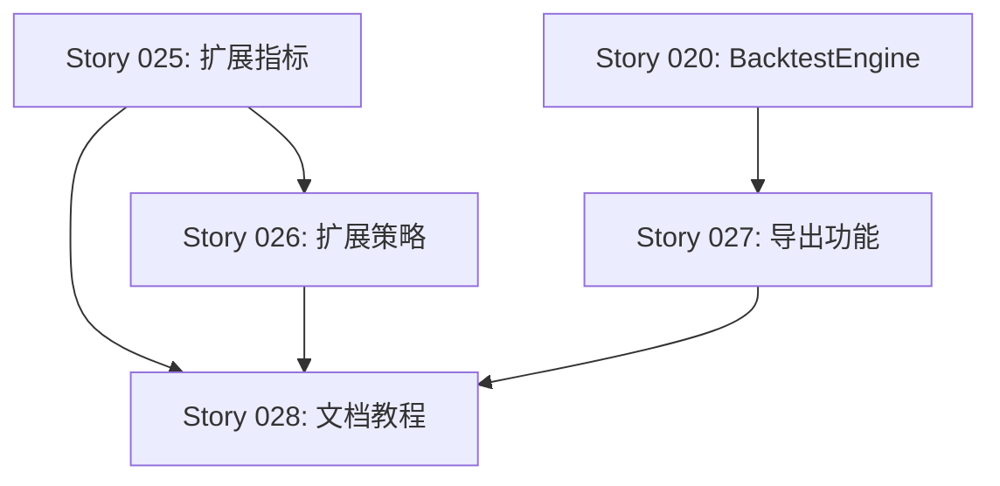

# v0.4.0 Overview - 参数优化和策略扩展

**版本**: v0.4.0
**主题**: Parameter Optimization & Strategy Expansion
**状态**: 📋 计划中
**预计时间**: 2-3 周
**依赖**: v0.3.0 完成 ✅

---

## 🎯 版本目标

v0.4.0 专注于丰富策略生态系统，提供更多开箱即用的指标和策略，以及完善的导出和文档功能。

### 核心目标

1. **扩展指标库**: 从 7 个增加到 15+ 个技术指标
2. **扩展策略库**: 从 3 个增加到 5+ 个内置策略
3. **结果导出**: 支持 JSON/CSV 格式导出回测结果
4. **完善文档**: 提供完整的策略开发教程和最佳实践

---

## 📋 Story 列表

| Story ID | 名称 | 优先级 | 预计工时 | 状态 |
|----------|------|--------|----------|------|
| [STORY-025](./STORY_025_EXTENDED_INDICATORS.md) | 扩展技术指标库 (8+ 指标) | P1 | 3-4 天 | 📋 待开始 |
| [STORY-026](./STORY_026_EXTENDED_STRATEGIES.md) | 扩展内置策略 (2+ 策略) | P1 | 4-5 天 | 📋 待开始 |
| [STORY-027](./STORY_027_BACKTEST_EXPORT.md) | 回测结果导出和可视化 | P2 | 2-3 天 | 📋 待开始 |
| [STORY-028](./STORY_028_STRATEGY_DEVELOPMENT_GUIDE.md) | 策略开发文档和教程 | P2 | 2 天 | 📋 待开始 |

**总预计工时**: 11-14 天

---

## 🚀 功能增量

### 新增技术指标 (Story 025)

**动量指标**:
- Williams %R
- CCI (Commodity Channel Index)
- ROC (Rate of Change)

**趋势指标**:
- ADX (Average Directional Index)
- Parabolic SAR

**成交量指标**:
- OBV (On Balance Volume)
- VWAP (Volume Weighted Average Price)

**高级指标**:
- Ichimoku Cloud (一目均衡表)

**总计**: 从 7 个 → 15 个指标

### 新增策略 (Story 026)

1. **Triple MA Crossover** - 三均线交叉
   - 多重确认机制
   - 适合趋势市场

2. **MACD Histogram Divergence** - MACD 柱状图背离
   - 捕捉反转点
   - 高胜率策略

3. **(可选) ADX Trend Following** - ADX 趋势跟随
4. **(可选) Volume Confirmation Breakout** - 成交量确认突破

**总计**: 从 3 个 → 至少 5 个策略

### 导出功能 (Story 027)

**JSON 导出**:
- 完整回测结果
- 元数据和配置
- 交易明细
- 权益曲线

**CSV 导出**:
- 交易明细 CSV
- 权益曲线 CSV

**CLI 集成**:
```bash
zigquant backtest \
  --strategy dual_ma \
  --config examples/strategies/dual_ma.json \
  --output results/dual_ma_2024.json \
  --export-trades results/trades.csv \
  --export-equity results/equity.csv
```

### 文档和教程 (Story 028)

**新增文档**:
- 快速入门教程 (15 分钟上手)
- IStrategy 接口完整文档
- StrategyContext API 参考
- 技术指标使用指南
- 调试和最佳实践
- FAQ (20+ 问题)

**示例代码**:
- 5 个教程示例（从入门到高级）
- 详细注释和说明

---

## 📊 预期成果

### 测试覆盖

- **单元测试**: 400+ 测试 (从 359 增加)
- **覆盖率**: > 85%
- **零内存泄漏**: 100% 通过 GPA 检测

### 性能指标

- **指标计算**: < 10ms / 1000 candles (每个指标)
- **策略执行**: < 10ms / candle
- **导出性能**: < 100ms / 1000 trades

### 文档完整性

- **Story 文档**: 4 个
- **Feature 文档**: 更新 3+ 个
- **Guide 文档**: 新增 9 个
- **示例代码**: 5+ 个完整示例

---

## 🔄 开发流程

### Week 1: 核心功能实现

**Day 1-2**: Story 025 - 动量和趋势指标
- Williams %R, CCI, ROC
- ADX, Parabolic SAR
- 单元测试和精度验证

**Day 3-4**: Story 025 - 成交量和高级指标
- OBV, VWAP
- Ichimoku Cloud
- 性能测试

**Day 5**: Story 026 - Triple MA 策略
- 策略实现
- 回测验证
- 配置文件

### Week 2: 策略扩展和导出

**Day 6-7**: Story 026 - MACD Divergence 策略
- 背离检测逻辑
- 策略实现
- 回测验证

**Day 8-9**: Story 027 - 导出功能
- JSON Exporter
- CSV Exporter
- CLI 集成

**Day 10**: Story 027 - Result Loader
- 结果加载工具
- 对比工具

### Week 3: 文档和收尾

**Day 11-12**: Story 028 - 文档编写
- 快速入门教程
- 接口文档
- 最佳实践
- FAQ

**Day 13**: 集成测试和 Bug 修复

**Day 14**: 文档审查和发布准备

---

## 🎯 验收标准

### 功能验收

- [ ] 所有 8 个新指标实现并通过测试
- [ ] 至少 2 个新策略实现并验证
- [ ] JSON/CSV 导出功能完整
- [ ] CLI 参数集成完成
- [ ] 所有示例代码可运行

### 质量验收

- [ ] 400+ 单元测试通过
- [ ] 覆盖率 > 85%
- [ ] 零内存泄漏
- [ ] 性能达标
- [ ] 编译无警告

### 文档验收

- [ ] 所有 Story 文档完成
- [ ] Feature 文档更新
- [ ] Guide 文档创建
- [ ] 示例代码有注释
- [ ] README 更新

---

## 📦 交付物

### 代码

```
src/indicators/
    ├── williams_r.zig          ✨
    ├── cci.zig                 ✨
    ├── roc.zig                 ✨
    ├── adx.zig                 ✨
    ├── parabolic_sar.zig       ✨
    ├── obv.zig                 ✨
    ├── vwap.zig                ✨
    └── ichimoku.zig            ✨

src/strategy/builtin/
    ├── triple_ma.zig           ✨
    ├── macd_divergence.zig     ✨
    └── (可选更多)

src/backtest/
    ├── export.zig              ✨
    ├── json_exporter.zig       ✨
    ├── csv_exporter.zig        ✨
    └── result_loader.zig       ✨
```

### 文档

```
docs/stories/v0.4.0/
    ├── OVERVIEW.md             ✨
    ├── PROGRESS_SUMMARY.md     ✨
    ├── STORY_025_*.md          ✨
    ├── STORY_026_*.md          ✨
    ├── STORY_027_*.md          ✨
    └── STORY_028_*.md          ✨

docs/guides/strategy/
    ├── quickstart.md           ✨
    ├── interface.md            ✨
    ├── context.md              ✨
    ├── indicators.md           ✨
    ├── debugging.md            ✨
    ├── best-practices.md       ✨
    ├── faq.md                  ✨
    └── examples/               ✨

docs/features/
    ├── indicators/             (更新)
    ├── strategy/               (更新)
    └── backtest/export.md      ✨
```

### 配置和示例

```
examples/strategies/
    ├── triple_ma.json          ✨
    ├── triple_ma_optimize.json ✨
    ├── macd_divergence.json    ✨
    └── tutorial/               ✨

examples/strategies/tutorial/
    ├── 01_hello_strategy.zig   ✨
    ├── 02_using_indicators.zig ✨
    ├── 03_risk_management.zig  ✨
    ├── 04_state_tracking.zig   ✨
    └── 05_advanced_signals.zig ✨
```

---

## 🔗 依赖关系

### 技术依赖

- Zig 0.13.0+
- 现有框架 (v0.3.0)
- zig-clap (已集成)

### Story 依赖



**关键路径**: Story 025 → Story 026 → Story 028

**并行任务**: Story 027 可与 Story 025/026 并行开发

---

## 🎯 成功指标

### 定量指标

| 指标 | v0.3.0 | v0.4.0 目标 | 增长 |
|------|--------|------------|------|
| 技术指标数 | 7 | 15+ | +114% |
| 内置策略数 | 3 | 5+ | +67% |
| 单元测试数 | 359 | 400+ | +11% |
| 文档页数 | ~20 | ~35+ | +75% |
| 示例代码 | 8 | 13+ | +63% |

### 定性指标

- [ ] 用户可在 15 分钟内创建第一个策略
- [ ] 策略开发文档被认为"清晰易懂"
- [ ] 导出功能满足分析需求
- [ ] 性能无明显下降

---

## 🚧 风险和缓解

### 技术风险

| 风险 | 影响 | 概率 | 缓解措施 |
|------|------|------|---------|
| 指标计算精度问题 | 高 | 中 | 与 TA-Lib 对比测试 |
| 性能下降 | 中 | 低 | 持续性能基准测试 |
| 内存泄漏 | 高 | 低 | GPA 检测 + 代码审查 |
| 导出文件过大 | 低 | 中 | 流式写入 + 压缩选项 |

### 进度风险

| 风险 | 影响 | 概率 | 缓解措施 |
|------|------|------|---------|
| Story 耗时超预期 | 中 | 中 | 优先 P1，P2 可推迟 |
| 文档编写耗时长 | 低 | 高 | 使用模板，复用内容 |
| Bug 修复延迟发布 | 中 | 低 | 预留 Buffer 时间 |

---

## 📅 里程碑

### M1: 指标扩展完成 (Week 1 结束)
- [ ] 8 个新指标实现
- [ ] 单元测试通过
- [ ] 精度测试通过

### M2: 策略扩展完成 (Week 2 Day 7)
- [ ] 2+ 个新策略实现
- [ ] 回测验证完成
- [ ] 配置文件完成

### M3: 导出功能完成 (Week 2 Day 10)
- [ ] JSON/CSV 导出实现
- [ ] CLI 集成完成
- [ ] 测试通过

### M4: 文档完成 (Week 3 Day 12)
- [ ] 所有文档编写完成
- [ ] 示例代码完成
- [ ] 审查通过

### M5: v0.4.0 发布 (Week 3 Day 14)
- [ ] 所有验收标准通过
- [ ] 发布说明完成
- [ ] Git tag 创建

---

## 🔄 后续规划

v0.4.0 完成后，将进入 v0.5.0 - 事件驱动架构：

- MessageBus 消息总线
- Cache 高性能缓存
- DataEngine 数据引擎
- libxev 异步 I/O
- 实盘 Paper Trading

参见 [roadmap.md](../../roadmap.md)

---

**创建时间**: 2024-12-26
**最后更新**: 2024-12-26
**作者**: Claude (Sonnet 4.5)
